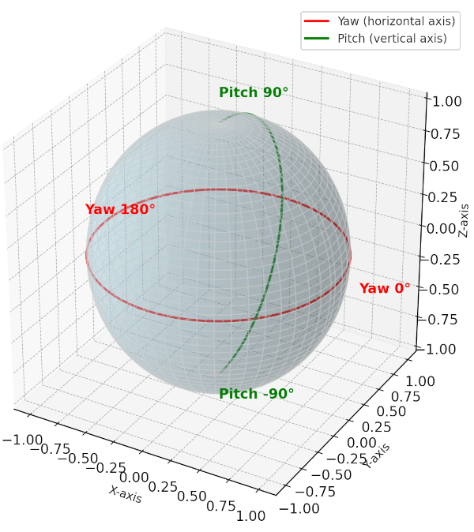
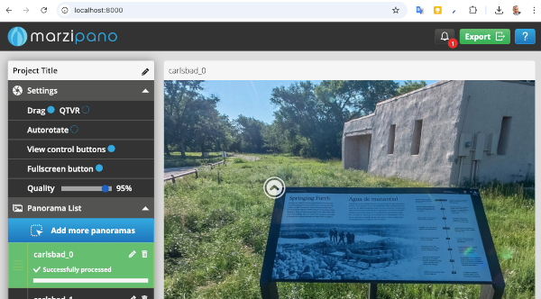

# Assessment of Marzipano Viewer for Virtual Tour Software using Carlsbad Cavern Picture Data


[live site](https://codetricity.github.io/carlsbad-tour/)

If you want to build a virtual tour, do not use this repo.  Use the free [Marzipano tool](https://www.marzipano.net/tool/), which is closed source.

This is useful if you want to learn more about how to build virtual tour software using 
[Marzipano](https://github.com/google/marzipano) as the 360 image viewer.  

This assessment is for people thinking of building their
own software to manage 360 images in these use cases:

* factory floor monitoring and optimization
* retail space optimization
* real estate sales
* virtual experiences for parks, museums, hotels
* natural disaster assessment
* public infrasture assessment - sewer pipes, rain water drainage, power lines

Intended input pictures are from a RICOH THETA X or Z1.
This study prototypes manual placement of the hotspots.

In the future, we will look at other features of RICOH THETA cameras which have built-in compass, gyroscope,
and accelerometer. This data is stored in the image metadata.
In Addition, the THETA X has GNSS support.

This study uses individual pictures without metadata.
The primary learning focus is on these concepts:

* hotspot events and data format for hotspots
* pitch and yaw of image and hotspots
* basic Marzipano concepts such as geometry, limit, view, scene
* UI interaction to get pitch and yaw information needed to build the tour

Marzipano is only the 360 image viewer.  However, as it is used
in Marzipano Tool, it is a good reference to build your own
virtual tour software.

## data format

There does not appear to be a standard format for virtual tour
information on objects such as scenes, pitch, yaw, hotspots,
and settings.

The data I'm using looks like this:

```json
const data = [
  {
    filename: "carlsbad_0.jpg",
    yaw: 0.009621012850468347,
    pitch: 0.5,
    hotspots: [
      {
        yaw: -0.8043556272753545,
        pitch: -0.10639414611516074,
        switchTo: 1,
        icon: "up.png",
      },
```

## Pitch and Yaw

Pitch is up and down.  Yaw is right to left.
The degrees are in radians.  `2 * pi` is a full 360 degree
circle.  `1 * pi` is 180 degrees.  



### Getting pitch and yaw

As this is an educational project, I am getting the pitch
and yaw by clicking the mouse on a scene in the viewer
and calculating
the pitch and yaw.

To get the pitch and yaw of specific points in a scene,
I added a rudimentary tool that saves pitch and yaw to the
clipboard.  These values are then pasted into `data.json`.

The pitch and yaw tool appears when the mouse is pressed
for more than 3.1 seconds.


This is the relevant code.

```javascript
// Convert to normalized coordinates (0 to 1)
var x = relativeX / rect.width;
var y = relativeY / rect.height;
// Use  method from Marzipano View: screenToCoordinates
var result = currentView.screenToCoordinates({ x: relativeX, y: relativeY });
```

The result has properties for pitch and yaw.

```text
Yaw: ${result.yaw}, Pitch: ${result.pitch}`
```

For initial view, placing mouse in center of screen gives the center
of the view.

For the hotspot, the mouse is in the upper right corner.

## images

Images are from a RICOH THETA Z1 taken by the National Park
Service and released under the [Public Domain, No Copyright](https://creativecommons.org/publicdomain/mark/1.0/).

Photostream

<https://www.flickr.com/photos/193079646@N03/with/52283079899>

## other tools

* [panorama-to-cubemap](https://github.com/jaxry/panorama-to-cubemap)
* [transform360](https://github.com/facebook/transform360)

## future

### performance optimization

* replace equirectangular with cubemap and explain difference
* multiresolution loading
* optimize image loading

### editing

* move from mouse long-press to editor mode button
* use Marzipano Tool again for ideas
  * build a subset as open source
* write data to downloadable file
* based on [this discussion](https://groups.google.com/g/marzipano/c/6EF6Q_37aMo/m/DYVM-r1PAQAJ), it's possible to run Marzipano locally

### data standardization

* revise data format with Marzipano Tool as a reference.

### Develop strategy for auto-placement of view and yaw

RICOH THETA metadata has these fields:

* PoseHeadingDegrees = 236.5
* PosePitchDegrees = 0.0
* PoseRollDegrees = 0.0

Pitch and roll are disabled due to auto-leveling.


When the THETA X GPS unit is enabled, these fields
are also available.


Metadata information is [available on GitHub](https://github.com/ricohapi/theta-api-specs/blob/main/theta-metadata/README.md).

Video CaMM data extraction.

`exiftool -ee -V3 path/to/your/video.MP4 > path/to/results.txt`

#### CaMM data community discussions

* [IMU Data Libraries](https://github.com/ricohapi/theta-api-specs/blob/main/theta-metadata/README.md)
* [RICOH THETA Z1 Firmware 3.01.1 - Adds Single-Fisheye, simultaneous recording of 2 videos, 50min video length](https://community.theta360.guide/t/ricoh-theta-z1-firmware-3-01-1-adds-single-fisheye-simultaneous-recording-of-2-videos-50min-video-length/9095?u=craig)

## Running Marzipano Tool Locally

Marzipano Tool is build on Marzipano.

Run a web server locally such as `python -m http.server`


